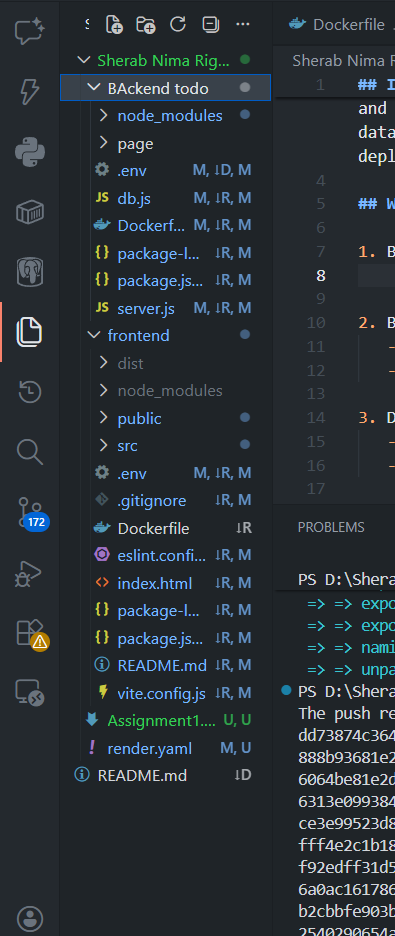
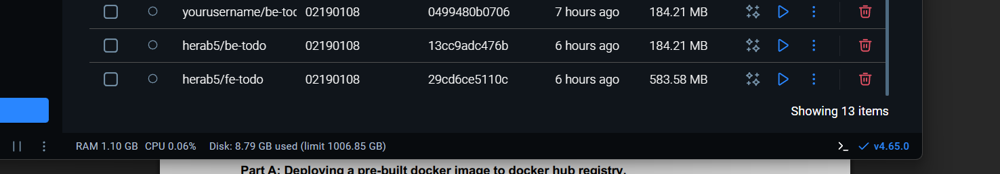
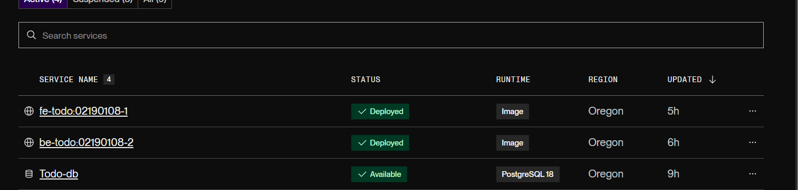
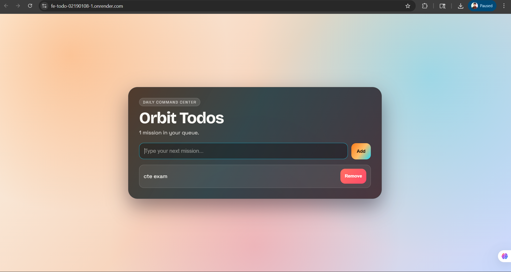
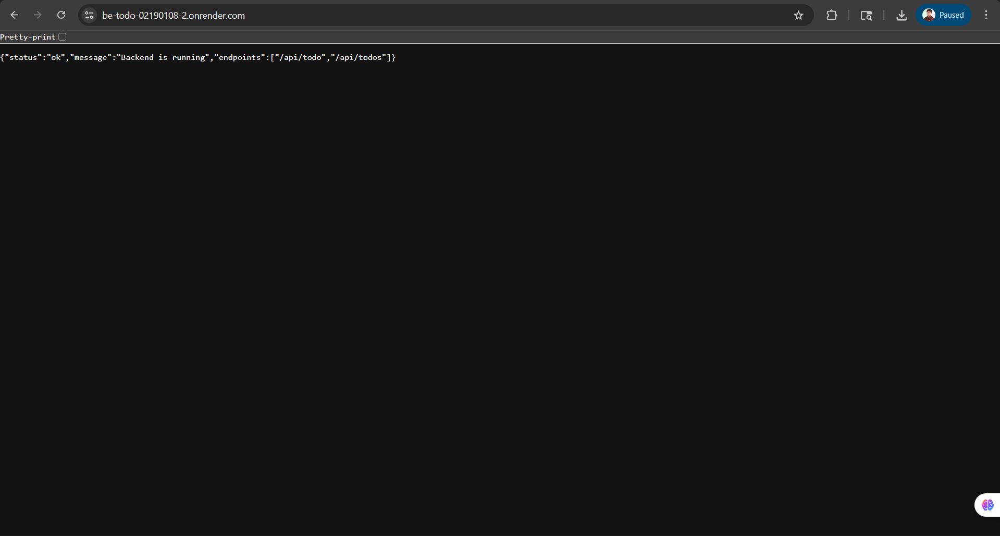

## Introduction

This assignment was to develop and publish a basic Web application. Created a To-Do List application using Frontend and Backend. Both parts were shipped in Docker, after which they were deployed on Render.com to run online. Also linked the back end to a web-based database to ensure that the tasks are stored permanently. This was an opportunity for me to learn how to use Docker, deploy application to cloud and connect application to a managed database.

## What I did

1. Built the backend and frontend 

2. Dockerized both services
   - Wrote Dockerfiles for the frontend and backend so each service can run inside a container.
   - Built Docker images locally and pushed them to Docker Hub so they can be pulled by Render.

3. Deployed to Render
   - Pulled the Docker images into Render and created services for the frontend and backend.
   - Provisioned a managed database on Render and configured the backend to use it for storing tasks.

4. Tested and debugged
   - Verified that the frontend communicates correctly with the backend and that tasks persist in the remote database.
   - Resolved issues such as CORS configuration and environment variables to ensure reliable communication between services.

## Frontend

## Backend

## Conclusion

This task was a hands-on experience in deploying and hosting applications on the cloud using containers. I learned how to:

- Design and develop a basic web app (front + back end).
- Develop Dockerfiles, build images and upload to a Docker registry.
- Deploy container images to Render and set up a managed database.
Resolve typical deployment problems, such as CORS and environment variables.

This work has now made me feel confident with packaging applications using Docker and deploying them to a cloud service. Now I get how to take a project from development to live and how to persist data in a hosted database. Future enhancements may involve user authentication, more robust error handling and automated testing to make the app more robust.