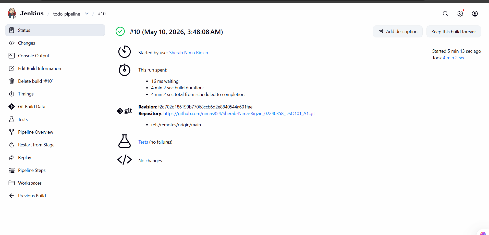
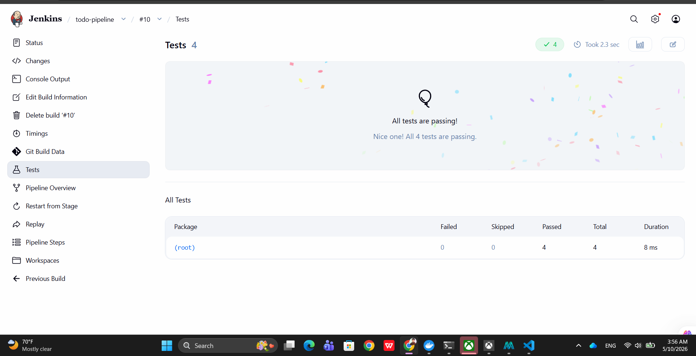
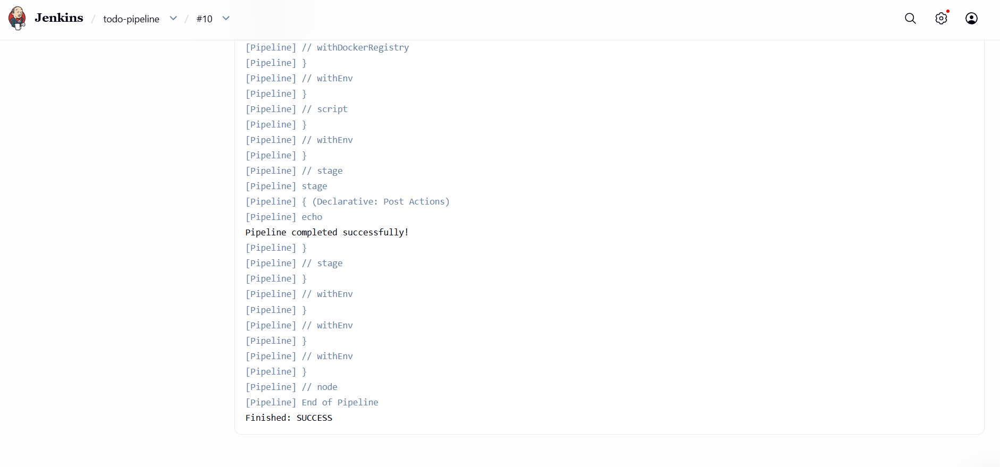
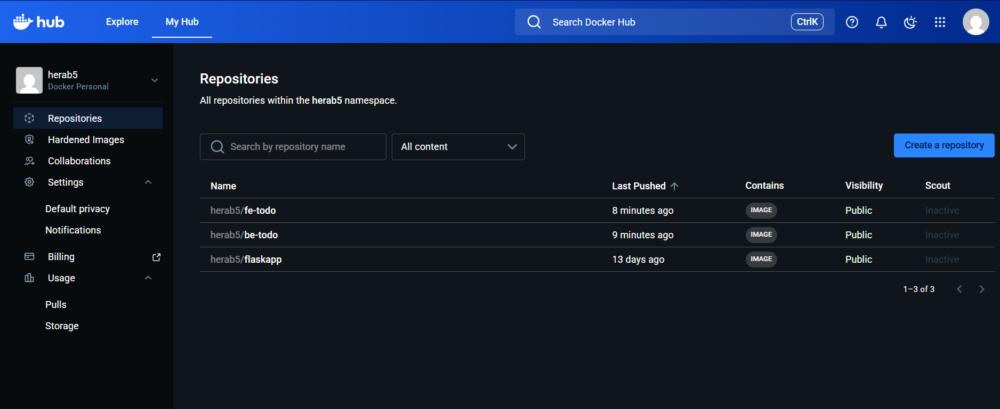

## Introduction
This assignment will involve setting up a CI/CD (Continuous Integration and Continuous Deployment) pipeline to automate the build, testing, and deployment of my Todo List application from Assignment 1 by utilizing Jenkins.

The pipeline automatically carries out all the processes:

1) Getting the code from GitHub
2) Installing the required dependencies
3) Running unit tests
4) Building Docker images
5) Pushing the images to Docker Hub

For this assignment, the tools and technologies will be:

1. Jenkins — used for automating the CI/CD process
2. GitHub — for storing the source code
3. Node.js and npm — for running and managing JavaScript packages
4. Jest and jest-junit — for testing and generating test reports
5. Docker — for building and managing Docker images
6. Docker Hub — for storing Docker images

 ### Pipeline Overview

### Test Results

### Console Output

###  Docker Hub 

## Challenges Faced 

#### Challenge 1 - Missing Docker Pipeline Plugin
The first major challenge I faced was with the Jenkins plugins. I think it was due to our net work issue as after long period of trying, I installed all plugin.

### Challenge 2 - Local C: Drive Storage Issue
The second major challenge was with disk space on my local C: drive.To overcome this, I shifted the Jenkins workspace and home directory to my D: drive 

## Conclusion 
This assignment gave me practical experience in creating a complete CI/CD pipeline using Jenkins. I learned how to automate the full software delivery process, from getting the code to deployment.

The pipeline can automatically:

Install dependencies,
Run unit tests using Jest,
Build Docker images, and 
Push images to Docker Hub

All of these tasks are done automatically without any manual work.