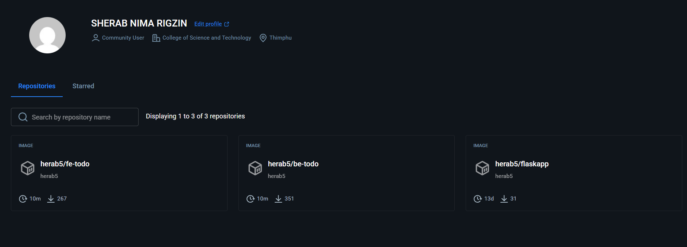
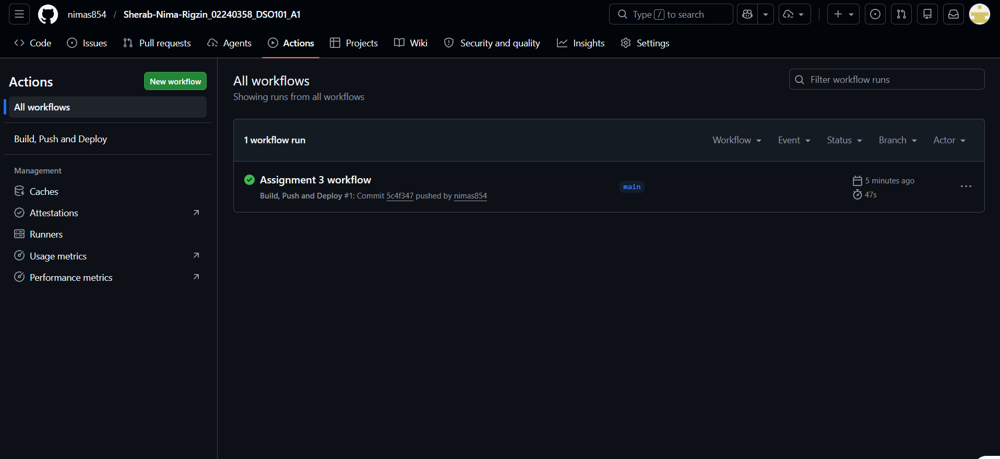
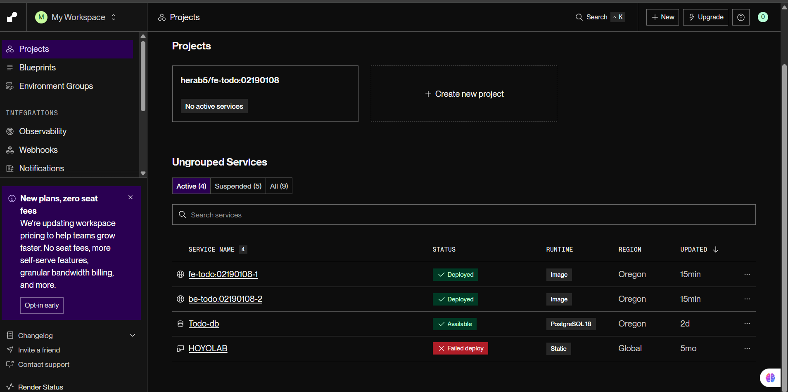

## Introduction
This is an assignment to create a CI/CD pipeline with GitHub Actions. The pipeline automatically creates Docker containers, uploads the images to DockerHub and deploys them to Render.com. This assignment was  completed using the same application as in Assignment 1

## Steps Taken

### Step 1 - Verified GitHub Repository
- Ensured repository was set to Public
- Verified package.json had correct scripts
- Confirmed Dockerfiles existed for both frontend and backend

### Step 2 - Added GitHub Secrets
Added the following secrets under Settings > Secrets and variables > Actions:
- DOCKERHUB_USERNAME - Docker Hub username
- DOCKERHUB_TOKEN - Docker Hub access token
- RENDER_BACKEND_HOOK - Render deploy hook URL for backend
- RENDER_FRONTEND_HOOK - Render deploy hook URL for frontend

### Step 3 - Created GitHub Actions Workflow
Created .github/workflows/deploy.yml with these steps:
1. Checkout Repository
2. Login to DockerHub
3. Build and Push Backend Docker Image
4. Build and Push Frontend Docker Image
5. Deploy Backend to Render via webhook
6. Deploy Frontend to Render via webhook

### Step 4 - Pushed to GitHub
Pushed all changes to main branch which triggered the workflow automatically.

### Step 5 - Verified Deployment
Confirmed all steps passed with green checkmarks in GitHub Actions.

### Docker

### GitHub Actions Success

### Render

## Challenge 
I initially wasn't sure how to properly add GitHub Secrets, so I got that right off the bat. I accidentally put both the secret name and value in the wrong fields. I had learnt that the Name field is the secret identifier and Secret field is the secret itself, and then added all four secrets without any mistake.

## Learning outcome 

- Learned how to set up GitHub Actions workflows for CI/CD automation
- Understood how to safely store credentials using GitHub Secrets
- Learned how to automatically build and push Docker images whenever code is pushed
- Understood how to deploy applications on Render using webhook URLs
- Gained experience with the complete CI/CD process from code push to live deployment

## link
- Backend: https://be-todo-02190108-2.onrender.com
- Frontend: https://fe-todo-02190108-1.onrender.com