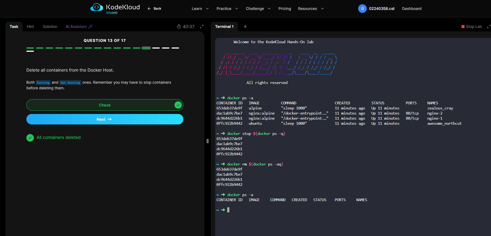
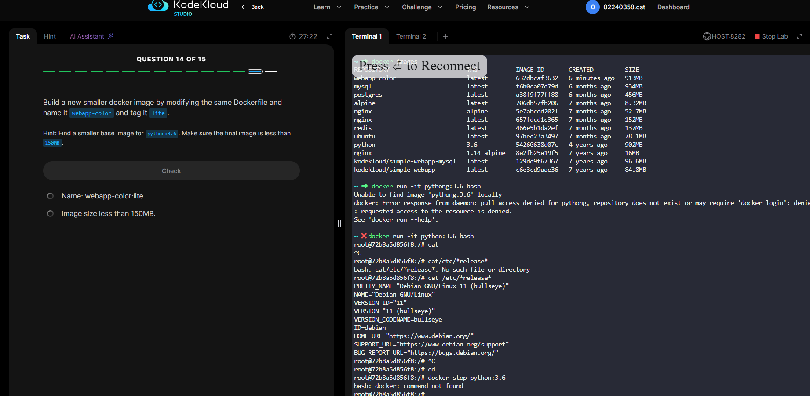

# Introduction

The contents of this document reflect the learning and research activities related to Docker, CI/CD pipelines, GitHub Actions, Render, and Jenkins.

This learning session aimed to gain insight into real-life software engineering using modern software deployment and automation tools. During this process, we learned the basics of Docker, how to manage containers, how to build images, how to create automated deployment pipelines, and the tools used in DevOps.

These technologies are important because they help developers develop, test, deploy, and manage applications more efficiently.

---

## kodeKloud

In this learning session, we learned the core Docker commands and how Docker works.

The commands we practiced include:

- Viewing Docker images
- Viewing running and stopped containers
- Stopping containers
- Deleting containers
- Removing images
- Running containers

We also learned more advanced Docker concepts, such as:

- Building Docker images using Dockerfile
- Editing and managing containers
- Understanding the difference between container ports and host ports
- Working with Docker images and containers in detail

---

# Research

## 1. How to Pull Images in Render

Render allows us to deploy applications using Docker images.

We researched how to:

- Connect a GitHub repository with Render
- Use Docker images for deployment
- Pull images from Docker Hub
- Deploy applications automatically

This helps in hosting applications online easily.

---

## 2. Practicing CI/CD Pipeline and GitHub Actions

We explored how CI/CD pipelines work using GitHub Actions through YouTube.

Video Reference:  
https://youtu.be/y7S2oSjJ8PA?si=JmbcU9_cTcdFUndo

### What we learned:

- CI means Continuous Integration
- CD means Continuous Deployment/Delivery
- GitHub Actions automates testing and deployment
- Workflows can run automatically whenever code is pushed to GitHub
- It helps developers save time and reduce manual work

### Example Workflow

1. Developer pushes code to GitHub
2. GitHub Actions runs tests
3. If the tests pass, the application is deployed automatically

---

## 3. Jenkins Setup and Usage

We researched Jenkins and learned:

- How to install Jenkins
- How Jenkins automates tasks
- Creating build pipelines
- Connecting Jenkins with GitHub
- Running automated builds and deployments

### Benefits of Jenkins

- Automates repetitive tasks
- Helps in the CI/CD process
- Reduces manual deployment work
- Improves the software development workflow

---

## 4. Difference Between Docker and Virtual Machine

We also researched the difference between Docker containers and Virtual Machines (VMs).

### Docker Container

- Lightweight
- Faster startup
- Shares the host operating system
- Uses less memory

### Virtual Machine

- Has its own operating system
- Uses more resources
- Slower compared to Docker
- More isolated environment

Docker is widely used in modern software development because it is fast and efficient.

---

# Conclusion

Through this learning and research, we improved our understanding of Docker, CI/CD pipelines, GitHub Actions, Render, and Jenkins.

We learned how containers help package applications, how automation tools improve deployment processes, and how modern DevOps tools work together in real-world software development.

These skills are important for software engineering and cloud-based application deployment.
